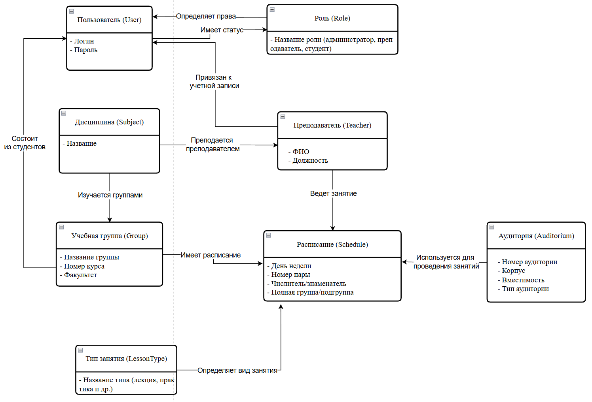
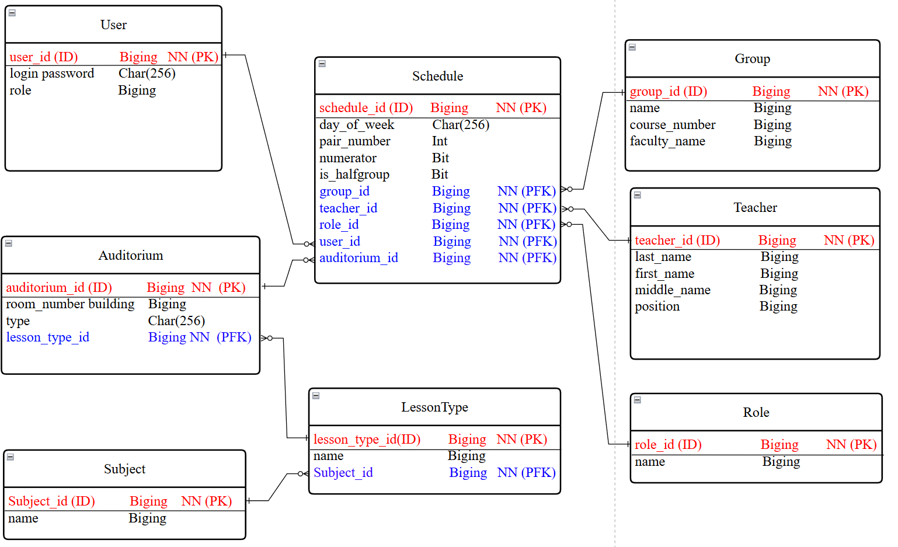
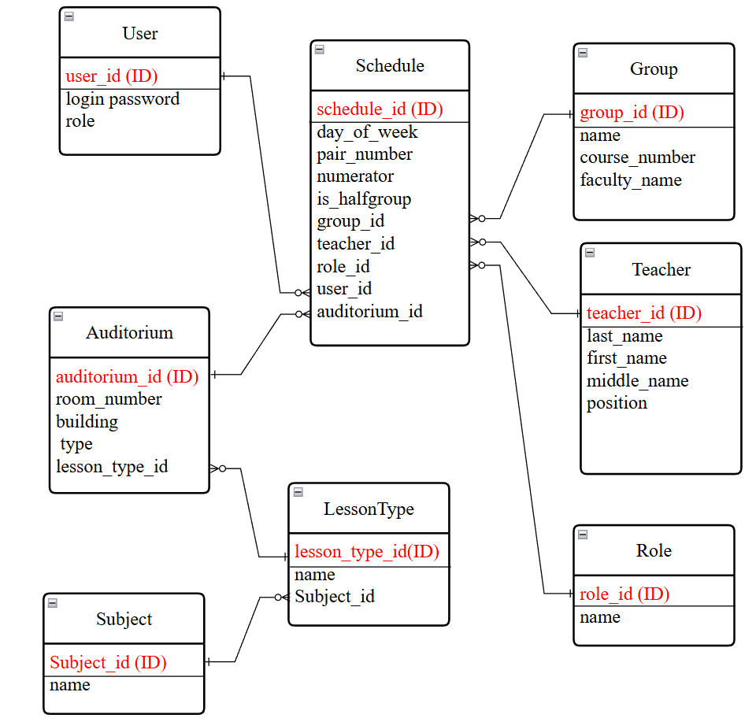
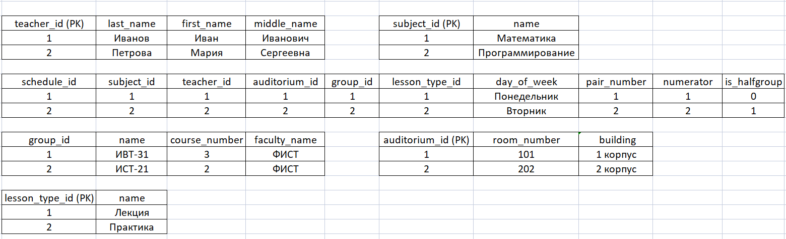
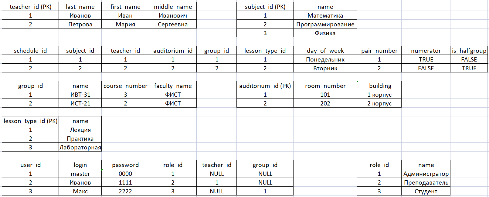

# ⚫ UNIVERSITY SCHEDULE SYSTEM

> **Dark Edition** | Расписание вуза без компромиссов


Десктопное приложение для автоматизации составления и управления расписанием аудиторных занятий в вузе.

Приложение обеспечивает разграничение прав доступа для администраторов, преподавателей и студентов, исключает конфликты в расписании и позволяет формировать отчеты.

## 🚀 Функциональность

- **🔐 Ролевая модель:** Администратор, Преподаватель, Студент
- **📅 Управление расписанием:** Добавление, редактирование, удаление занятий
- **⚠️ Проверка на конфликты:** Контроль занятости аудиторий, преподавателей и учебных групп
- **📊 Отчетность:** Формирование отчетов по преподавателям, группам и аудиториям
- **🔍 Фильтрация:** Просмотр расписания для конкретной группы или преподавателя

## 🛠 Технологический стек

*   **Backend:** C#, .NET Framework
*   **Frontend:** Windows Forms (WinForms)
*   **Database:** Microsoft SQL Server
*   **Data Access:** ADO.NET
*   **Проектирование:** UML, IDEF0

## 📸 Скриншоты и диаграммы

<details>
<summary><b>Диаграммы проекта</b> (Нажми, чтобы развернуть)</summary>

| Концептуальная модель | Логическая модель данных |
| :---: | :---: |
|  |  |

| Физическая модель данных | Диаграмма IDEF0 |
| :---: | :---: |
|  |  |

| Нормализация данных (1NF-3NF) |
| :---: |
|  |
|  |
|  |

</details>

## 🗄️ Структура базы данных

Проект включает полноценную реляционную базу данных с реализацией всех нормальных форм (1NF-3NF).

## 📦 Установка и запуск

1.  **Клонируйте репозиторий:**
    ```bash
    git clone https://github.com/Titan0zxc/university-schedule-system.git
    ```

2.  **Восстановите базу данных:**
    *   Откройте `SQL Server Management Studio`
    *   Выполните скрипт из файла `Database/script.sql`

3.  **Запустите решение:**
    *   Откройте `Расписание_занятий.sln` в **Visual Studio**
    *   Соберите и запустите решение (F5)

## 📄 Документация

Полная техническая документация проекта доступна в файле:
- [Информационная_система_расписание_занятий.docx](docs/Информационная_система_расписание_занятий.docx)

## 👨‍💻 Разработчик

**Евгений** - Начинающий .NET разработчик

*   📧 Почта: [Titanozxc@gmail.com](mailto:Titanozxc@gmail.com)
*   💻 GitHub: [Titan0zxc](https://github.com/Titan0zxc)

## 🔗 Ссылки на другие проекты

*   🪵 [Wood Production Management](https://github.com/Titan0zxc/wood-production-management) - Система управления деревообрабатывающим предприятием

---
*Этот проект был разработан в учебных целях.*
